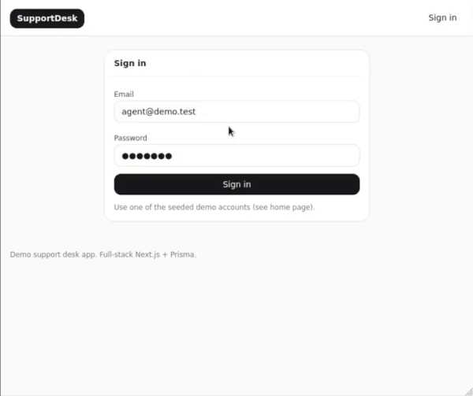

<h1 align="center">SupportDesk App</h1>

<p align="center">
  
</p>

<p align="center">
  Next.js helpdesk app with auth, roles, and tickets — backed by Postgres via Docker Compose.
</p>

<p align="center">
  <a href="https://codespaces.new/asafr-dev/supportdesk-app?quickstart=1"></a>
  <a href="https://github.com/asafr-dev/supportdesk-app/actions/workflows/ci.yml"></a>
  <a href="https://github.com/asafr-dev/supportdesk-app/actions/workflows/codeql.yml"></a>
  <a href="https://codecov.io/gh/asafr-dev/supportdesk-app"></a>
  <a href="https://www.codefactor.io/repository/github/asafr-dev/supportdesk-app"></a>
  <a href="LICENSE"></a>
</p>

<p align="center">
  
</p>

## 🎬 Demo

**Live demo:** [supportdesk-app-demo.up.railway.app](https://supportdesk-app-demo.up.railway.app)

## 🚀 Quickstart

### Requirements

- Linux
- Node 20+
- Docker

### Run locally

```bash
cp .env.example .env
npm ci
npm run setup
npm run dev
```

Open [http://localhost:3000](http://localhost:3000)

### Run via Codespaces

This repo ships a `.devcontainer` that starts Postgres via docker-compose and forwards port 3000.

In Codespaces:

```bash
cp .env.example .env
npm ci
npm run db:setup
npm run dev
```

Open [http://localhost:3000](http://localhost:3000) from the Ports tab

## 🧪 How to test

After installing dependencies:

```bash
npm run check
```

## 🗂️ Project structure

For the full directory map and “what goes where” conventions, see
[STRUCTURE.md](docs/STRUCTURE.md).

- `src/app/` – app code (Next.js App Router)
- `src/lib/` – shared utilities/integrations (auth/audit/db)
- `prisma/` – schema + migrations
- `tests/` – unit + Playwright e2e
- `docs/` – longer-form documentation (architecture, ops, tradeoffs, etc)

## 📚 Documentation

See [documentation](docs/)

## 🤝 Contributing

See the [contributing guidelines](https://github.com/asafr-dev/.github/blob/main/CONTRIBUTING.md)

- Future ideas: [ROADMAP.md](docs/ROADMAP.md)

## 🔒 Security

See the [security policy](https://github.com/asafr-dev/.github/blob/main/SECURITY.md)

## 📄 License

See [LICENSE](LICENSE)
