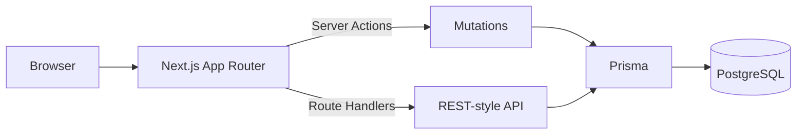

# Architecture (SupportDesk App)

This is intentionally simple and review-friendly:

## Key design choices

- **Cookie-backed DB sessions**: very small surface area,
  no external auth dependency for this demo.
- **RBAC**: USER (requester), AGENT (triage), ADMIN (user management).
- **Audit log**: ticket-scoped; ticket lifecycle mutations
  (create, status changes, comments, assignment) write entries.
