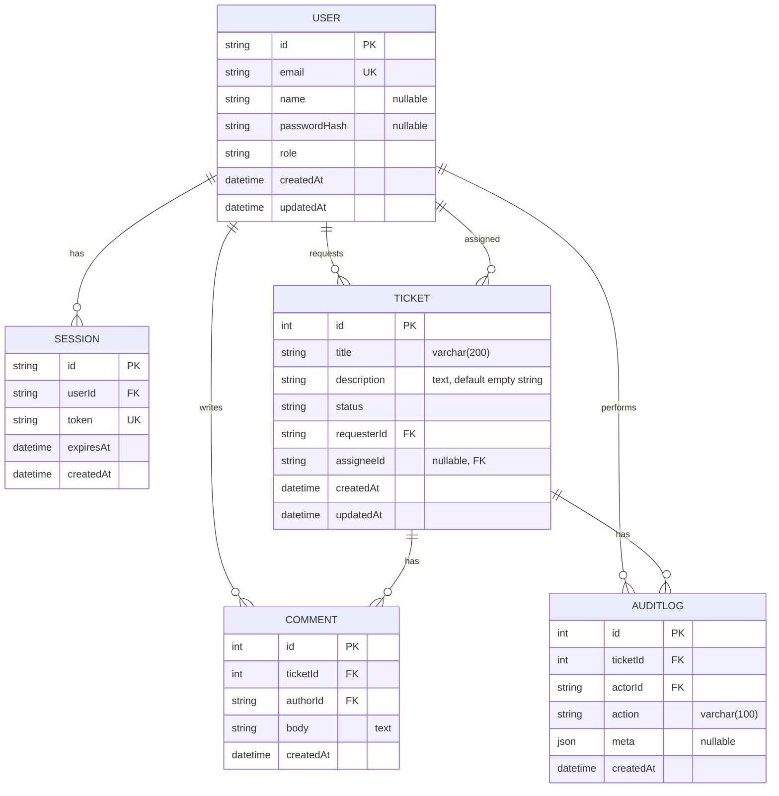

# Data model

Source of truth: `prisma/schema.prisma` (Prisma + PostgreSQL).

## Prisma schema (verbatim)

```prisma
generator client {
  provider = "prisma-client-js"
}

datasource db {
  provider = "postgresql"
  url      = env("DATABASE_URL")
}

enum Role {
  USER
  AGENT
  ADMIN
}

enum TicketStatus {
  OPEN        @map("open")
  IN_PROGRESS @map("in_progress")
  RESOLVED    @map("resolved")
}

model User {
  id           String   @id @default(cuid())
  email        String   @unique
  name         String?
  passwordHash String?
  role         Role     @default(USER)

  sessions         Session[]
  ticketsRequested Ticket[] @relation("TicketRequester")
  ticketsAssigned  Ticket[] @relation("TicketAssignee")
  comments         Comment[]
  auditLogs        AuditLog[]

  createdAt DateTime @default(now())
  updatedAt DateTime @updatedAt

  @@index([role])
}

model Session {
  id        String   @id @default(cuid())
  userId    String
  token     String   @unique
  expiresAt DateTime
  createdAt DateTime @default(now())

  user User @relation(fields: [userId], references: [id], onDelete: Cascade)

  @@index([userId])
  @@index([expiresAt])
}

model Ticket {
  id          Int          @id @default(autoincrement())
  title       String       @db.VarChar(200)
  description String       @default("") @db.Text
  status      TicketStatus @default(OPEN)

  requesterId String
  requester   User         @relation("TicketRequester", fields: [requesterId], references: [id])

  assigneeId String?
  assignee   User?         @relation("TicketAssignee", fields: [assigneeId], references: [id])

  comments  Comment[]
  auditLogs AuditLog[]

  createdAt DateTime @default(now())
  updatedAt DateTime @updatedAt

  @@index([status, updatedAt])
  @@index([requesterId])
  @@index([assigneeId])
}

model Comment {
  id       Int      @id @default(autoincrement())
  ticketId Int
  authorId String
  body     String   @db.Text

  ticket Ticket @relation(fields: [ticketId], references: [id], onDelete: Cascade)
  author User   @relation(fields: [authorId], references: [id], onDelete: Cascade)

  createdAt DateTime @default(now())

  @@index([ticketId, createdAt])
  @@index([authorId])
}

model AuditLog {
  id       Int      @id @default(autoincrement())
  ticketId Int
  actorId  String
  action   String   @db.VarChar(100)
  meta     Json?

  ticket Ticket @relation(fields: [ticketId], references: [id], onDelete: Cascade)
  actor  User   @relation(fields: [actorId], references: [id], onDelete: Cascade)

  createdAt DateTime @default(now())

  @@index([ticketId, createdAt])
  @@index([actorId, createdAt])
}
```

## Delete behavior (FK constraints)

From `prisma/migrations/.../migration.sql`:

| FK                              | ON DELETE  |
| ------------------------------- | ---------- |
| `Session.userId → User.id`      | `CASCADE`  |
| `Ticket.requesterId → User.id`  | `RESTRICT` |
| `Ticket.assigneeId → User.id`   | `SET NULL` |
| `Comment.ticketId → Ticket.id`  | `CASCADE`  |
| `Comment.authorId → User.id`    | `CASCADE`  |
| `AuditLog.ticketId → Ticket.id` | `CASCADE`  |
| `AuditLog.actorId → User.id`    | `CASCADE`  |

**Implications**

- You **cannot** delete a `User` referenced by any ticket as `requesterId` (`RESTRICT`) unless those tickets are deleted **or** their `requesterId` is updated to another user.
- If a deletable `User` is referenced by tickets as `assigneeId`, deleting the user sets `assigneeId = NULL` (`SET NULL`).
- When a `User` delete is allowed, their `Session`, `Comment` (as author), and `AuditLog` (as actor) rows are deleted automatically (`CASCADE`).
- Deleting a `Ticket` deletes its `Comment` and `AuditLog` rows (`CASCADE`).

## ER diagram



## Enums

### `Role`

- Values: `USER`, `AGENT`, `ADMIN`
- Default: `USER`

### `TicketStatus`

Prisma enum values are mapped to lowercase DB strings (via `@map`):

| Prisma value  | Stored DB value |
| ------------- | --------------- |
| `OPEN`        | `open`          |
| `IN_PROGRESS` | `in_progress`   |
| `RESOLVED`    | `resolved`      |

Default: `OPEN`

## Models (exhaustive)

### `User`

Fields

| Field          | Type       | Nullable | Attributes / DB notes  |
| -------------- | ---------- | -------: | ---------------------- |
| `id`           | `String`   |       No | `@id @default(cuid())` |
| `email`        | `String`   |       No | `@unique`              |
| `name`         | `String`   |      Yes | —                      |
| `passwordHash` | `String`   |      Yes | —                      |
| `role`         | `Role`     |       No | `@default(USER)`       |
| `createdAt`    | `DateTime` |       No | `@default(now())`      |
| `updatedAt`    | `DateTime` |       No | `@updatedAt`           |

Relations

- `sessions: Session[]`
- `ticketsRequested: Ticket[] @relation("TicketRequester")`
- `ticketsAssigned: Ticket[] @relation("TicketAssignee")`
- `comments: Comment[]`
- `auditLogs: AuditLog[]`

Indexes

- `@@index([role])`

Delete behavior (actual DB constraints)

- **Blocked** if the user is referenced by any ticket as `requesterId` (`Ticket_requesterId_fkey ON DELETE RESTRICT`).
- If deletion is allowed:
  - `Session` rows cascade-delete (`ON DELETE CASCADE`).
  - `Comment` rows cascade-delete (`ON DELETE CASCADE`).
  - `AuditLog` rows cascade-delete (`ON DELETE CASCADE`).
  - Any tickets where they were assignee will have `assigneeId = NULL` (`ON DELETE SET NULL`).

---

### `Session`

Fields

| Field       | Type       | Nullable | Attributes / DB notes  |
| ----------- | ---------- | -------: | ---------------------- |
| `id`        | `String`   |       No | `@id @default(cuid())` |
| `userId`    | `String`   |       No | —                      |
| `token`     | `String`   |       No | `@unique`              |
| `expiresAt` | `DateTime` |       No | —                      |
| `createdAt` | `DateTime` |       No | `@default(now())`      |

Relation

- `user: User @relation(fields: [userId], references: [id], onDelete: Cascade)`

Indexes

- `@@index([userId])`
- `@@index([expiresAt])`

Delete behavior (actual DB constraints)

- Deleting the linked `User` would cascade-delete this row (`ON DELETE CASCADE`) **if** the `User` delete is not blocked by `Ticket.requesterId` (`RESTRICT`).

---

### `Ticket`

Fields

| Field         | Type           | Nullable | Attributes / DB notes                  |
| ------------- | -------------- | -------: | -------------------------------------- |
| `id`          | `Int`          |       No | `@id @default(autoincrement())`        |
| `title`       | `String`       |       No | `@db.VarChar(200)`                     |
| `description` | `String`       |       No | `@default("") @db.Text`                |
| `status`      | `TicketStatus` |       No | `@default(OPEN)`                       |
| `requesterId` | `String`       |       No | FK to `User.id` (`ON DELETE RESTRICT`) |
| `assigneeId`  | `String`       |      Yes | FK to `User.id` (`ON DELETE SET NULL`) |
| `createdAt`   | `DateTime`     |       No | `@default(now())`                      |
| `updatedAt`   | `DateTime`     |       No | `@updatedAt`                           |

Relations

- `requester: User @relation("TicketRequester", fields: [requesterId], references: [id])`
- `assignee: User? @relation("TicketAssignee", fields: [assigneeId], references: [id])`
- `comments: Comment[]`
- `auditLogs: AuditLog[]`

Indexes

- `@@index([status, updatedAt])`
- `@@index([requesterId])`
- `@@index([assigneeId])`

Delete behavior (actual DB constraints)

- Deleting the requester user is **restricted** while this ticket exists (`ON DELETE RESTRICT`).
- Deleting the assignee user sets `assigneeId = NULL` (`ON DELETE SET NULL`).
- Deleting the ticket cascades to delete:
  - its `Comment` rows (`Comment.ticketId ON DELETE CASCADE`)
  - its `AuditLog` rows (`AuditLog.ticketId ON DELETE CASCADE`)

---

### `Comment`

Fields

| Field       | Type       | Nullable | Attributes / DB notes                   |
| ----------- | ---------- | -------: | --------------------------------------- |
| `id`        | `Int`      |       No | `@id @default(autoincrement())`         |
| `ticketId`  | `Int`      |       No | FK to `Ticket.id` (`ON DELETE CASCADE`) |
| `authorId`  | `String`   |       No | FK to `User.id` (`ON DELETE CASCADE`)   |
| `body`      | `String`   |       No | `@db.Text`                              |
| `createdAt` | `DateTime` |       No | `@default(now())`                       |

Relations

- `ticket: Ticket @relation(fields: [ticketId], references: [id], onDelete: Cascade)`
- `author: User @relation(fields: [authorId], references: [id], onDelete: Cascade)`

Indexes

- `@@index([ticketId, createdAt])`
- `@@index([authorId])`

Delete behavior (actual DB constraints)

- Deleting the ticket cascades to delete comments (`ON DELETE CASCADE`).
- Deleting the author cascades to delete comments (`ON DELETE CASCADE`) **if** the author delete is not blocked by `Ticket.requesterId` (`RESTRICT`).

---

### `AuditLog`

Fields

| Field       | Type       | Nullable | Attributes / DB notes                   |
| ----------- | ---------- | -------: | --------------------------------------- |
| `id`        | `Int`      |       No | `@id @default(autoincrement())`         |
| `ticketId`  | `Int`      |       No | FK to `Ticket.id` (`ON DELETE CASCADE`) |
| `actorId`   | `String`   |       No | FK to `User.id` (`ON DELETE CASCADE`)   |
| `action`    | `String`   |       No | `@db.VarChar(100)`                      |
| `meta`      | `Json`     |      Yes | —                                       |
| `createdAt` | `DateTime` |       No | `@default(now())`                       |

Relations

- `ticket: Ticket @relation(fields: [ticketId], references: [id], onDelete: Cascade)`
- `actor: User @relation(fields: [actorId], references: [id], onDelete: Cascade)`

Indexes

- `@@index([ticketId, createdAt])`
- `@@index([actorId, createdAt])`

Delete behavior (actual DB constraints)

- Deleting the ticket cascades to delete audit rows (`ON DELETE CASCADE`).
- Deleting the actor cascades to delete audit rows (`ON DELETE CASCADE`) **if** the actor delete is not blocked by `Ticket.requesterId` (`RESTRICT`).

---

## Migration source (verbatim, for auditability)

```sql
-- CreateEnum
CREATE TYPE "Role" AS ENUM ('USER', 'AGENT', 'ADMIN');

-- CreateEnum
CREATE TYPE "TicketStatus" AS ENUM ('open', 'in_progress', 'resolved');

-- CreateTable
CREATE TABLE "User" (
    "id" TEXT NOT NULL,
    "email" TEXT NOT NULL,
    "name" TEXT,
    "passwordHash" TEXT,
    "role" "Role" NOT NULL DEFAULT 'USER',
    "createdAt" TIMESTAMP(3) NOT NULL DEFAULT CURRENT_TIMESTAMP,
    "updatedAt" TIMESTAMP(3) NOT NULL DEFAULT CURRENT_TIMESTAMP,

    CONSTRAINT "User_pkey" PRIMARY KEY ("id")
);

-- CreateTable
CREATE TABLE "Session" (
    "id" TEXT NOT NULL,
    "userId" TEXT NOT NULL,
    "token" TEXT NOT NULL,
    "expiresAt" TIMESTAMP(3) NOT NULL,
    "createdAt" TIMESTAMP(3) NOT NULL DEFAULT CURRENT_TIMESTAMP,

    CONSTRAINT "Session_pkey" PRIMARY KEY ("id")
);

-- CreateTable
CREATE TABLE "Ticket" (
    "id" SERIAL NOT NULL,
    "title" VARCHAR(200) NOT NULL,
    "description" TEXT NOT NULL DEFAULT '',
    "status" "TicketStatus" NOT NULL DEFAULT 'open',
    "requesterId" TEXT NOT NULL,
    "assigneeId" TEXT,
    "createdAt" TIMESTAMP(3) NOT NULL DEFAULT CURRENT_TIMESTAMP,
    "updatedAt" TIMESTAMP(3) NOT NULL DEFAULT CURRENT_TIMESTAMP,

    CONSTRAINT "Ticket_pkey" PRIMARY KEY ("id")
);

-- CreateTable
CREATE TABLE "Comment" (
    "id" SERIAL NOT NULL,
    "ticketId" INTEGER NOT NULL,
    "authorId" TEXT NOT NULL,
    "body" TEXT NOT NULL,
    "createdAt" TIMESTAMP(3) NOT NULL DEFAULT CURRENT_TIMESTAMP,

    CONSTRAINT "Comment_pkey" PRIMARY KEY ("id")
);

-- CreateTable
CREATE TABLE "AuditLog" (
    "id" SERIAL NOT NULL,
    "ticketId" INTEGER NOT NULL,
    "actorId" TEXT NOT NULL,
    "action" VARCHAR(100) NOT NULL,
    "meta" JSONB,
    "createdAt" TIMESTAMP(3) NOT NULL DEFAULT CURRENT_TIMESTAMP,

    CONSTRAINT "AuditLog_pkey" PRIMARY KEY ("id")
);

-- CreateIndex
CREATE UNIQUE INDEX "User_email_key" ON "User"("email");

-- CreateIndex
CREATE INDEX "User_role_idx" ON "User"("role");

-- CreateIndex
CREATE UNIQUE INDEX "Session_token_key" ON "Session"("token");

-- CreateIndex
CREATE INDEX "Session_userId_idx" ON "Session"("userId");

-- CreateIndex
CREATE INDEX "Session_expiresAt_idx" ON "Session"("expiresAt");

-- CreateIndex
CREATE INDEX "Ticket_status_updatedAt_idx" ON "Ticket"("status", "updatedAt");

-- CreateIndex
CREATE INDEX "Ticket_requesterId_idx" ON "Ticket"("requesterId");

-- CreateIndex
CREATE INDEX "Ticket_assigneeId_idx" ON "Ticket"("assigneeId");

-- CreateIndex
CREATE INDEX "Comment_ticketId_createdAt_idx" ON "Comment"("ticketId", "createdAt");

-- CreateIndex
CREATE INDEX "Comment_authorId_idx" ON "Comment"("authorId");

-- CreateIndex
CREATE INDEX "AuditLog_ticketId_createdAt_idx" ON "AuditLog"("ticketId", "createdAt");

-- CreateIndex
CREATE INDEX "AuditLog_actorId_createdAt_idx" ON "AuditLog"("actorId", "createdAt");

-- AddForeignKey
ALTER TABLE "Session" ADD CONSTRAINT "Session_userId_fkey" FOREIGN KEY ("userId") REFERENCES "User"("id") ON DELETE CASCADE ON UPDATE CASCADE;

-- AddForeignKey
ALTER TABLE "Ticket" ADD CONSTRAINT "Ticket_requesterId_fkey" FOREIGN KEY ("requesterId") REFERENCES "User"("id") ON DELETE RESTRICT ON UPDATE CASCADE;

-- AddForeignKey
ALTER TABLE "Ticket" ADD CONSTRAINT "Ticket_assigneeId_fkey" FOREIGN KEY ("assigneeId") REFERENCES "User"("id") ON DELETE SET NULL ON UPDATE CASCADE;

-- AddForeignKey
ALTER TABLE "Comment" ADD CONSTRAINT "Comment_ticketId_fkey" FOREIGN KEY ("ticketId") REFERENCES "Ticket"("id") ON DELETE CASCADE ON UPDATE CASCADE;

-- AddForeignKey
ALTER TABLE "Comment" ADD CONSTRAINT "Comment_authorId_fkey" FOREIGN KEY ("authorId") REFERENCES "User"("id") ON DELETE CASCADE ON UPDATE CASCADE;

-- AddForeignKey
ALTER TABLE "AuditLog" ADD CONSTRAINT "AuditLog_ticketId_fkey" FOREIGN KEY ("ticketId") REFERENCES "Ticket"("id") ON DELETE CASCADE ON UPDATE CASCADE;

-- AddForeignKey
ALTER TABLE "AuditLog" ADD CONSTRAINT "AuditLog_actorId_fkey" FOREIGN KEY ("actorId") REFERENCES "User"("id") ON DELETE CASCADE ON UPDATE CASCADE;
```
